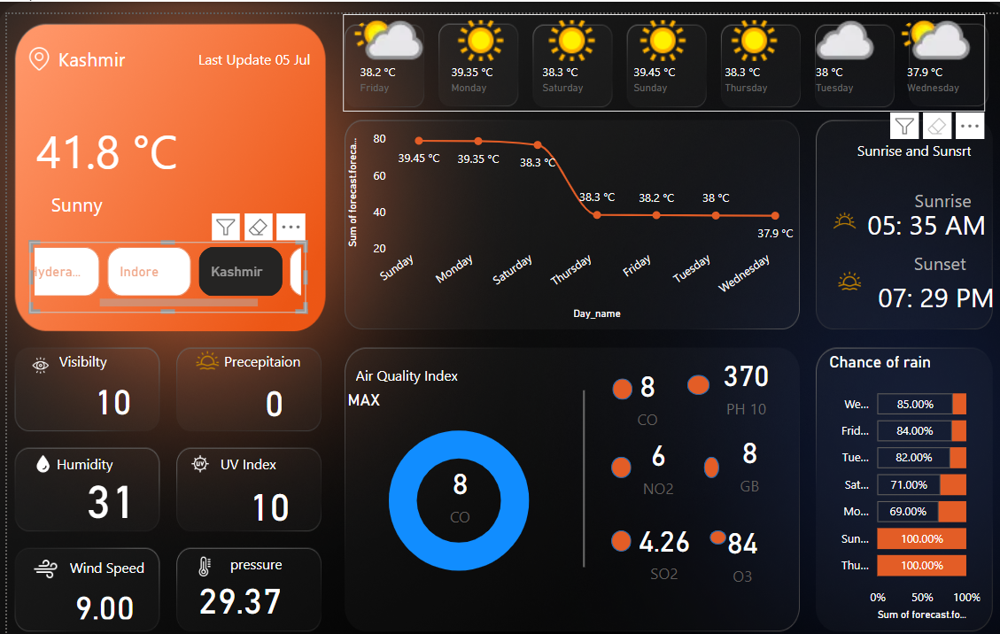

# 🌦️ Power BI Weather & AQI Dashboard

A dynamic and visually appealing **Power BI dashboard** built using **WeatherAPI** to showcase real-time weather and air quality (AQI) data for multiple cities.

---

## 📌 Overview

This project connects to live JSON endpoints from [WeatherAPI](https://www.weatherapi.com/) and visualizes:

- 🌡️ Temperature, humidity, pressure, wind  
- 🌫️ Air quality (PM2.5, CO, SO2, NO2, etc.)  
- 📅 7-day weather forecast with icons  
- 📍 City selection slicers with location icons  
- 🧠 Smart text-based AQI health suggestions  
- 🕒 “Last Updated” field with custom date formatting  

---

## 🔧 Tools & Features

| Category       | Details                                           |
|----------------|---------------------------------------------------|
| **Source**     | WeatherAPI JSON (current + forecast endpoints)   |
| **Platform**   | Power BI Desktop                                  |
| **API Key**    | Required (free from WeatherAPI.com)              |
| **Visuals**    | Cards, line charts, icons, slicers, tooltips     |
| **Custom Logic** | AQI color, status, suggestions (via DAX)      |

---

## 📸 Preview

> 

---

## 📁 How to Use

1. Clone or download the `.pbix` file.  
2. Get your API key from [weatherapi.com](https://weatherapi.com/).  
3. In Power BI, open `Transform Data` and update the URL with your key.  
4. Select cities and explore your live weather dashboard!  

---

## 👩‍💻 Author

**Himani Verma**  
B.Sc. (Hons.) Computer Science | Delhi University  
GitHub: []

